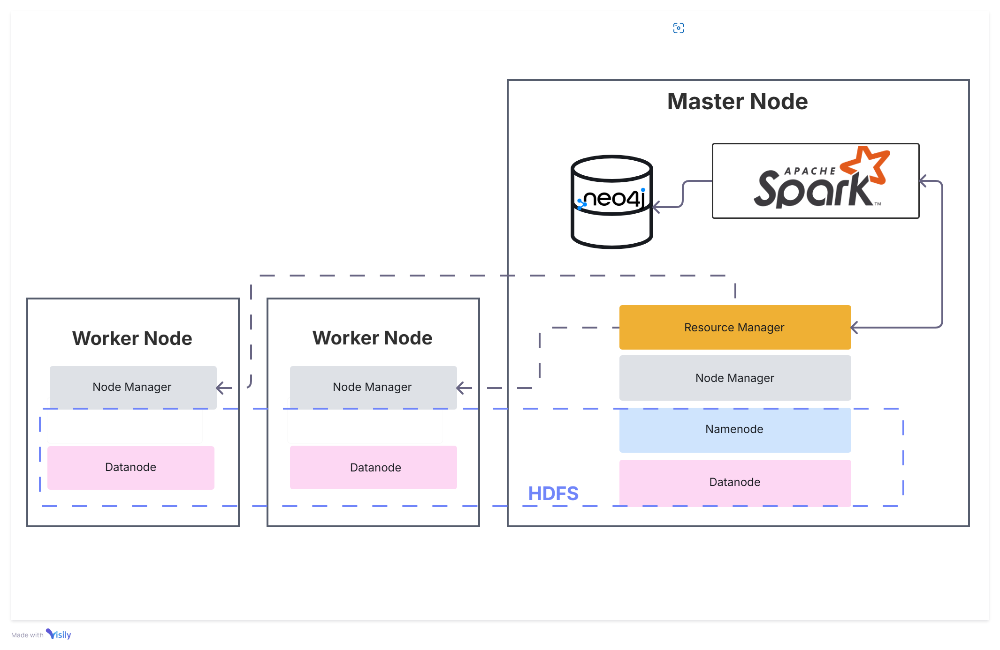

# Movie Recommendation System

<!-- > -->

## Introduzione
Lo scopo di questo progetto è sviluppare un sistema di raccomandazione di film che offra suggerimenti personalizzati agli utenti, basandosi sulle loro preferenze riguardanti i film che hanno già visto e valutato.

Per raggiungere tale obiettivo sono state integrate diverse tecnologie: 
- **Spark** e **Hadoop** per il processamento distribuito dei dati, garantendo così la scalabilità necessaria per gestire grandi volumi di informazioni. <!--BAH SARA' FORSE VERO???abbiamo scalato bene?-->
- **Neo4j** viene impiegato per rappresentare e analizzare le relazioni tra utenti e film, essendo particolarmente adatto a gestire i grafi. <!--Da riscrivere meglio after Neo4j-->


## Datasets 

Inizialmente, l'intento era quello di utilizzare il **Netflix Prize Dataset** (~2 GB) [Netflix Dataset](https://www.kaggle.com/datasets/netflix-inc/netflix-prize-data), oggetto di una competizione tenutasi su larga scala. Tuttavia, per motivi di praticità e di testing iniziale, si è scelto di adottare il **MovieLens Dataset**, disponibile in due varianti:

- **Small**: 100.000 valutazioni fatte a 9.000 film da parte di 600 utenti (~1 MB);
- **Full**: circa 33.000.000 valutazioni fatte a 86.000 film da parte di 330.975 utenti (~28 GB).

Entrambe le versioni sono reperibili sul sito ufficiale di GroupLens: [MovieLens Dataset](https://grouplens.org/datasets/movielens/latest/). Per il progetto si è inizialmente utilizzata la versione small per testare e ottimizzare l'implementazione, al fine di  scalare successivamente alla versione big. <!--Eh dove possibile però perché poi crasha-->

Il **MovieLens Dataset** è composto da diversi file che descrivono valutazioni, film e altri metadati.
In particolare, i file utilizzati sono:

- **`ratings.csv`**: contiene informazioni riguardanti le valutazioni che gli utenti hanno fornito ai film visti. Questo file include 100.836 record e presenta i seguenti campi:
  - **userId**: identificativo univoco dell'utente;
  - **movieId**: identificativo univoco del film;
  - **rating**: valutazione assegnata dall'utente al film, espressa su una scala da 0.5 a 5.0;
  - **timestamp**: data e ora in formato timestamp in cui la valutazione è stata registrata.

- **`movies.csv`**: include i dettagli sui film, con un totale di 9.000 record. I campi principali sono:
  - **movieId**: identificativo univoco del film, che corrisponde al campo `movieId` in `ratings.csv`;
  - **title**: titolo del film;
  - **genres**: generi del film, separati da un carattere "|" (ad esempio, *Action|Adventure|Fantasy*).

Si è scelto il dataset MovieLens anche perché rende possibile la riproduzione della struttura del **Netflix Prize Dataset**. 
La struttura del dataset di Netflix è infatti la seguente:  
- **CustomerID**: identificativo univoco dell'utente;  
- **Rating**: valutazione assegnata, su una scala intera da 1 a 5;  
- **Date**: data della valutazione, nel formato `YYYY-MM-DD`.

Le caratteristiche principali del dataset di Netflix includono:  
- ID dei film che variano da 1 a 17.770 in ordine sequenziale;  
- CustomerID che vanno da 1 a 2.649.429, con alcune lacune nei numeri;  
- Un totale di 480.189 utenti attivi.  

Grazie all'operazione di *pivot* sui dati di MovieLens, è possibile generare una struttura dati analoga, mappando gli utenti e i film secondo una rappresentazione coerente con quella di Netflix, semplificando così le analisi comparative e l'estensione del sistema di raccomandazione.  

## Approcci utilizzati (Implementazione?)
Sono stati adottati tre approcci principali per il sistema di raccomandazione, ciascuno organizzato in cartelle separate per mantenere chiarezza e modularità. 
Ogni cartella contiene un file `README.md` che descrive l'idea matematica alla base dell'approccio, insieme a un'analisi della complessità computazionale, del tempo di esecuzione e dell'utilizzo della memoria.  

1. **Alternating Least Squares (ALS)**  
ALS è un algoritmo di fattorizzazione delle matrici utilizzato per la raccomandazione collaborativa (*Collaborative Filtering*). 
La tecnica suddivide la matrice delle valutazioni in due matrici più piccole (utenti e film), riducendo le dimensioni e preservando le relazioni latenti.
   
2. **PageRank**  
Utilizzato per misurare l'importanza relativa dei nodi all'interno di un grafo bipartito (utenti-film). Dopo la conversione dei dati in grafi con la libreria *GraphFrames*:
   - Gli archi rappresentano le valutazioni (con peso derivato dal rating).
   - PageRank classifica film e utenti in base alla loro influenza. <!--NON CREDO SIA PROPRIO VERO, RIVEDI A MENTE LUCIDA--> 

    Il metodo si basa su un modello iterativo che tiene conto delle connessioni tra i nodi.
    Questo approccio consente di rappresentare anche il fatto che un utente  occasionalmente esplora film al di fuori delle proprie preferenze usuali.  


3. **SVD (Singular Value Decomposition)**    
SVD scompone la matrice delle valutazioni per estrarre feature latenti che rappresentano correlazioni tra utenti e film.  
Questa scomposizione consente di ridurre il rumore nei dati e identificare pattern latenti significativi, migliorando la capacità di raccomandazione.


## Architettura del sistema
  

Il sistema viene implementato realizzando un cluster Hadoop composto da:  
- **Un nodo Master (Namenode)**: Responsabile della gestione del file system distribuito (HDFS) e delle risorse tramite YARN (Resource Manager).  
- **Due nodi Worker (Datanode)**: Eseguono le operazioni distribuite su HDFS e gestiscono task assegnati dal Resource Manager.  

Il cluster comunica tramite una rete bridged, garantendo isolamento e semplicità di configurazione.  

L'applicazione sfrutta:  
1. **HDFS** per l'archiviazione distribuita dei dataset MovieLens.  
2. **YARN** per la gestione delle risorse e l'esecuzione distribuita delle applicazioni.  
3. **Apache Spark** per l'elaborazione distribuita di grandi volumi di dati.  
4. **Neo4j** come database grafico per analisi avanzate sui dati relazionali. 


## Prerequisiti
In questa sezione sono elencati i prerequisiti software necessari per l'esecuzione del sistema:
1. **Apache Hadoop 3.2.4**; [[hadoop](https://hadoop.apache.org/release/3.2.4.html)]
2. **Apache Spark 3.5.4** [[spark](https://spark.apache.org/downloads.html)]
3. **Java 8**;  [[java](https://www.oracle.com/java/technologies/javase/javase8u211-later-archive-downloads.html)]
4. **Neo4j 1.6.1**;

Il programma di installazione di Java installerà automaticamente il jdk in C:\Program Files\Java\jdk1.8.0_351, mentre la destinazione JRE può essere modificata. 
I file di Hadoop e Spark possono essere estratti in qualsiasi cartella, ma si consiglia di estrarli nella root del disco per evitare percorsi lunghi.


## Setup/Configurazione del Cluster

Partendo da un'immagine Ubuntu e usando tre macchine virtuali (da 16 GB di RAM e 4 core ciascuna) si è configurato il cluster come di seguito riportato.

**1. Creazione di un Utente Dedicato per Hadoop**

Per motivi di sicurezza, è consigliabile creare un utente separato per Hadoop:

```bash
sudo usermod -aG sudo master
```

**2. Comunicazione fra le macchine tramite SSH**
 

Hadoop utilizza SSH per la comunicazione tra i nodi. È quindi necessario configurare l'accesso SSH *Passwordless* per l'utente Hadoop. 
Per semplificare la configurazione, tutti i dispositivi del cluster (nodo master e due nodi worker) utilizzano lo stesso nome utente (`master`), 
la stessa password e una configurazione condivisa delle chiavi pubbliche.  
Nonostante ciò, le tre macchine risultano comunque riconoscibili, come risulta nel file `/etc/hosts` presente in tutti i nodi:  
   ```text
   <IP_master>    master
   <IP_worker1>   worker1
   <IP_worker2>   worker2
   ```  

Con questa configurazione, Hadoop sarà in grado di comunicare tra i nodi senza richiedere continuamente l'inserimento di password, 
semplificando l'implementazione e l'esecuzione dei servizi.

**3. Download e Installazione di Hadoop**

- E' necessario scaricare l'ultima versione stabile di Hadoop dal sito ufficiale:

  ```bash
  wget https://downloads.apache.org/hadoop/common/hadoop-3.2.4/hadoop-3.2.4.tar.gz
  ```

- Successivamente, estrarre l'archivio e spostare i file:

  ```bash
  tar -xvzf hadoop-3.2.4.tar.gz
  mv hadoop-3.2.4 ~/hadoop
  ```
- Eseguire lo stesso procedimento per Spark.

- Si è creato uno script `custom-env.sh` in cui sono state inserite tutte le variabili d'ambiente utili per Hadoop, Spark e Java.

  ```bash
  #!/bin/sh

  #Hadoop Related Options
  export HADOOP_HOME=/home/worker1/hadoop-3.2.4
  export HADOOP_INSTALL=$HADOOP_HOME
  export HADOOP_MAPRED_HOME=$HADOOP_HOME
  export HADOOP_COMMON_HOME=$HADOOP_HOME
  export HADOOP_HDFS_HOME=$HADOOP_HOME
  export YARN_HOME=$HADOOP_HOME
  export HADOOP_COMMON_LIB_NATIVE_DIR=$HADOOP_HOME/lib/native
  export PATH=$PATH:$HADOOP_HOME/sbin:$HADOOP_HOME/bin
  export HADOOP_OPTS="-Djava.library.path=$HADOOP_HOME/lib/native"

  #Spark
  export SPARK_HOME=/home/worker1/spark-3.5.4-bin-hadoop3
  export PATH=$PATH:$SPARK_HOME/sbin:$SPARK_HOME/bin"
  ```

- A questo punto si può già verificare il corretto funzionamento di Spark:
  ```shell 
  > spark-shell --version 
  Welcome to
        ____              __
      / __/__  ___ _____/ /__
      _\ \/ _ \/ _ `/ __/  '_/
    /___/ .__/\_,_/_/ /_/\_\   version 3.5.3
        /_/

  Using Scala version 2.12.18, OpenJDK Client VM, 1.8.0_432
  Branch HEAD
  Compiled by user haejoon.lee on 2024-09-09T05:20:05Z
  Revision 32232e9ed33bb16b93ad58cfde8b82e0f07c0970
  Url https://github.com/apache/spark
  Type --help for more information.
  ```

**4. Configurazione dei File di Hadoop**
A questo punto per configurare un ambiente Hadoop è sufficiente modificare una serie di file di configurazione, situati nella cartella `%HADOOP_HOME%\etc\hadoop`:
- Nel file `hadoop-env.sh` va specificato il percorso di Java:

  ```bash
  nano $HADOOP_HOME/etc/hadoop/hadoop-env.sh
  ```

- Nel file `core-site.xml` aggiungere:

  ```xml
  <configuration>
    <property>
      <name>fs.defaultFS</name>
      <value>hdfs://localhost:9000</value>
    </property>
  </configuration>
  ```

- Nel file `hdfs-site.xml`:

  ```xml
  <configuration>
    <property>
      <name>dfs.replication</name>
      <value>1</value>
    </property>
    <property>
      <name>dfs.namenode.name.dir</name>
      <value>file:///C:/Hadoop/hadoop-3.2.4/data/namenode</value>
    </property>
    <property>
      <name>dfs.datanode.data.dir</name>
      <value>file:///C:/Hadoop/hadoop-3.2.4/data/datanode</value>
    </property>
  </configuration>
  ```

- Nel file `mapred-site.xml`:

  ```xml
  <configuration>
    <property>
      <name>mapreduce.framework.name</name>
      <value>yarn</value>
    </property>
  </configuration>
  ```

- Nel file `yarn-site.xml`:

  ```xml
  <configuration>
  <property>
    <name>yarn.nodemanager.aux-services</name>
    <value>mapreduce_shuffle</value>
  </property>
  <property>
    <name>yarn.nodemanager.auxservices.mapreduce.shuffle.class</name>  
    <value>org.apache.hadoop.mapred.ShuffleHandler</value>
  </property>
</configuration>
  

**5. Creazione delle directories**
A questo punto creare le cartelle `namenode` e `datanode` nella cartella `data`:
```shell
> mkdir %HADOOP_HOME%\data\namenode
> mkdir %HADOOP_HOME%\data\datanode
```

**6. Formattazione del NameNode**

Prima di avviare Hadoop, è necessario formattare il NameNode:

```bash
hdfs namenode -format
```

**7. Avvio del Cluster Hadoop**

A questo punto verificare che l'istallazione sia andata a buon fine:
```shell
> hadoop version
Hadoop 3.3.6
Source code repository https://github.com/apache/hadoop.git -r 1be78238728da9266a4f88195058f08fd012bf9c
Compiled by ubuntu on 2023-06-18T08:22Z
Compiled on platform linux-x86_64
Compiled with protoc 3.7.1
From source with checksum 5652179ad55f76cb287d9c633bb53bbd
This command was run using /C:/Hadoop/hadoop-3.3.6/share/hadoop/common/hadoop-common-3.3.6.jar
```

E per avviare i servizi Hadoop eseguire:
```bash
start-dfs.sh
start-yarn.sh
```

A questo punto il servizio è in esecuzione presso: 
- YARN Resource Manager: `http://master:8088`
- Hadoop Namenode: `http://localhost:9870`

**8. Inserire memorizzare il dataset in HDFS**

Creare la cartella `dataset` in HDFS per poi memorizzarvi i dataset di interesse:
```shell
hdfs dfs -mkdir /dataset
hdfs dfs -put /ml-latest/ratings.csv /dataset/ratings.csv
hdfs dfs -put /ml-latest/movies.csv /dataset/movies.csv
hdfs dfs -ls /
```

**9. Spark submit**

Il comando `spark-submit` permette di eseguire applicazioni Spark definite in script Python, Java, o Scala. Si possono specificare vari parametri di configurazione come risorse, modalità di esecuzione (cluster, client, ecc.), numero di esecutori e altre impostazioni personalizzate per Spark.

Esempio di esecuzione di un'applicazione Spark in modalità locale:
```bash
spark-submit \
  --master local[*] \
  --executor-memory 4G \
  --executor-cores 2 \
  my_spark_app.py
```

Ciò non è però strettamente necessario quando si lavora con notebook come Jupyter, dal momento che la Spark Session può essere creata direttamente all'interno di ogni notebook, come è stato fatto in questo progetto. 

**10. Creazione di un Ambiente Virtuale per Python**  

Hadoop e Spark richiedono una versione specifica di Python, che può differire dalla versione preinstallata nel sistema operativo Ubuntu. 
Per evitare conflitti e garantire un ambiente isolato e sicuro, si è optato per la creazione di un ambiente virtuale Python su ogni nodo (Master e Worker).  

La procedura seguita è stata la seguente:  

- **Creazione dell'ambiente virtuale:**  
  Per ogni nodo del cluster, si è creato un ambiente virtuale con Python:  
  ```bash
  python3 -m venv ~/test
  ```

- **Attivazione dell'ambiente virtuale:**  
  L'ambiente virtuale è stato attivato prima di ogni configurazione:  
  ```bash
  source test/bin/activate
  ```

- **Creazione di un file `requirements.txt`:**  
  Per garantire che tutte le dipendenze fossero identiche tra i nodi, è stato generato un file `requirements.txt` con tutte le librerie necessarie per l'esecuzione dei progetti Spark.
  
  Ogni nodo ha installato le dipendenze specificate nel file:  
  ```bash
  pip install -r requirements.txt
  ```


## Riferimenti e link utili

### Filtering

#### Collaborative Filtering
- **SVD / ALS / Matrix Factorization**
  - [Movie Recommender Visualization](https://github.com/alicefortuni/MovieRecommenderVis/tree/master)
  - [Netflix Prize Solution](https://pantelis.github.io/cs301/docs/common/lectures/recommenders/netflix/)
  - [SVD Algorithm](https://builtin.com/articles/svd-algorithm)
  - [Movie Recommender System](https://github.com/adinmg/movie_recommender_system) 

- **PageRank-based Filtering**
  - [Simple Recommender System using PageRank](https://medium.com/eni-digitalks/a-simple-recommender-system-using-pagerank-4a63071c8cbf)
  - [PageRank Recommendation System](https://github.com/pranay-ar/PageRank-Recommendation-System/blob/main/src/main/scala/MovieLensPageRank.scala)

- **Link-Prediction Filtering**
  - Prevede la probabilità di una relazione tra due nodi, come la valutazione di un film da parte di un utente. Può essere confrontato con SVD per la previsione delle valutazioni.

#### Content-based Filtering
- [Content-based Movie Recommendation System](https://github.com/DATUMBRIGHT/content-based-movie-recommendation-system) 

#### Item-based Filtering
- Calcolo della similarità tra gli item (film). 
  - [Step-by-Step Guide to Building Content-based Filtering](https://www.stratascratch.com/blog/step-by-step-guide-to-building-content-based-filtering/)
  - [Content-based Filtering](https://www.scaler.com/topics/machine-learning/content-based-filtering/)

#### Hybrid Filtering

#### Vector-Based Recommendation Systems
- [How to Create a Vector-Based Recommendation System](https://www.e2enetworks.com/blog/how-to-create-a-vector-based-recommendation-system)
- [Vector-Based Movie Recommendation System](https://towardsdatascience.com/how-to-create-a-vector-based-movie-recommendation-system-b6d4f7582d66) con [repo GitHub](https://github.com/arditobryan/Projects/tree/master/20211126_movie_plot_transformers)

#### K-means-based Filtering

### Popular Ranking Techniques
- Popularity-based Ranking
- KNN-based Ranking
- Matrix Factorization-based Ranking
- K-means-based Ranking
- PageRank-based Ranking

### Links
- [Definition of Ranking Algorithms](https://spotintelligence.com/2024/07/26/ranking-algorithms/#What_are_the_Types_of_Ranking_Algorithms)
- [Correlation-based Ranking](https://www.geeksforgeeks.org/python-implementation-of-movie-recommender-system/)
- [GitHub Topic: Movie Recommendation System](https://github.com/topics/movie-recomendation-system)
- [Machine Learning: Movie Recommendation System](https://github.com/ankitacoder3/Movie-Recommendation-System-MOVICO)
- [Paper Confronting Different Methods](https://pmc.ncbi.nlm.nih.gov/articles/PMC9269752/)
- [Machine-Learning Collaborative Filtering](https://www.freecodecamp.org/news/how-to-build-a-movie-recommendation-system-based-on-collaborative-filtering/)
- [Link Prediction](https://paperswithcode.com/task/link-prediction)
- [Link Prediction Survey](https://link.springer.com/article/10.1007/s11227-023-05591-8)
- [Awesome Link Prediction](https://github.com/Cloudy1225/Awesome-Link-Prediction)
- [Link Prediction for PageRank Fairness](https://github.com/ksemer/fairPRrec)
- [Matrix Completion for Recommended Systems](https://chenzl23.github.io/assets/pdf/ReviewOnRS-KAIS2022.pdf)
- [How to Install Hadoop](https://phoenixnap.com/kb/install-hadoop-ubuntu)